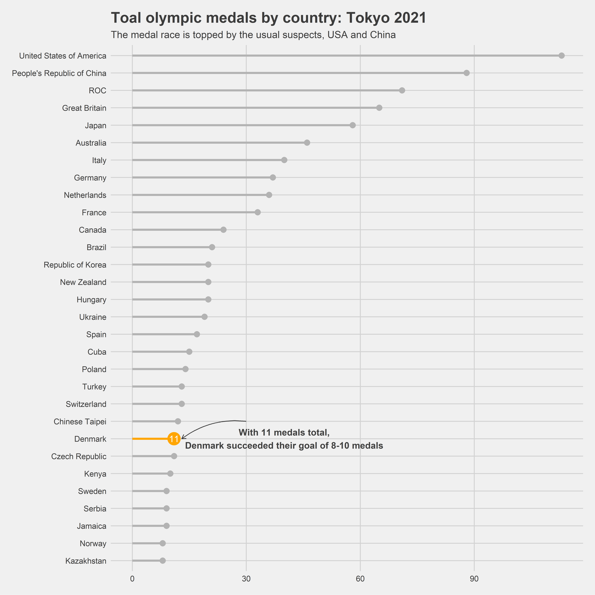
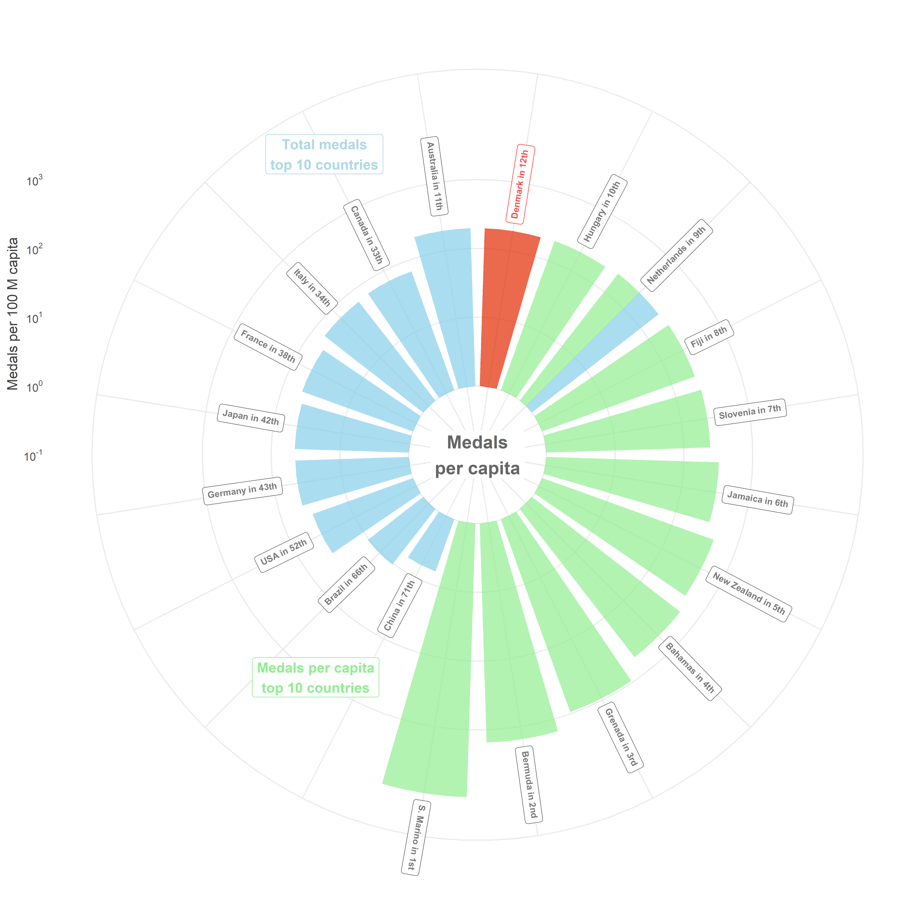

```r
knitr::opts_chunk$set(
  echo = TRUE,
  message = FALSE,
  cache = TRUE,
  warning = FALSE,
  fig.width = 10,
  fig.height = 10,
  dpi = 600
)

library(pacman)

p_load(
  tidyverse,
  here,
  janitor,
  readxl,
  ggthemes,
  DT,
  scales,
  ggtext
)
```


### Import data
It will be a challenge to make use of all the different datasets throughout the different visualizations.

```r
athletes <-
  read_excel(here("data", "athletes.xlsx")) %>%
  clean_names()

coaches <-
  read_excel(here("data", "coaches.xlsx")) %>%
  clean_names()

gender <-
  read_excel(here("data", "entriesgender.xlsx")) %>%
  clean_names()

teams <-
  read_excel(here("data", "teams.xlsx")) %>%
  clean_names()

athlete_events <-
  read_csv(here("data", "athlete_events.csv")) %>%
  clean_names()

noc_regions <-
  read_csv(here("data", "noc_regions.csv")) %>%
  clean_names()

medals <-
  read_csv(here("data", "Tokyo 2021 dataset.csv")) %>%
  clean_names() %>%
  mutate(
    across(where(is.character), factor)
  )
```

### Detailed overview in table
Nothing special here, just all medals information presented in a neat table.

```r
medals %>%
  datatable() %>%
  formatStyle("gold_medal", backgroundColor = "gold") %>%
  formatStyle("silver_medal", backgroundColor = "silver") %>%
  formatStyle("bronze_medal", backgroundColor = "orange")
```

```{=html}
<div id="htmlwidget-bafafd2bef3dc670c698" style="width:100%;height:auto;" class="datatables html-widget"></div>
<script type="application/json" data-for="htmlwidget-bafafd2bef3dc670c698">{"x":{"style":"bootstrap4","filter":"none","vertical":false,"data":[["1","2","3","4","5","6","7","8","9","10","11","12","13","14","15","16","17","18","19","20","21","22","23","24","25","26","27","28","29","30","31","32","33","34","35","36","37","38","39","40","41","42","43","44","45","46","47","48","49","50","51","52","53","54","55","56","57","58","59","60","61","62","63","64","65","66","67","68","69","70","71","72","73","74","75","76","77","78","79","80","81","82","83","84","85","86","87","88","89","90","91","92","93"],[1,2,3,4,5,6,7,8,9,10,11,12,13,14,15,16,17,18,19,20,21,22,23,24,25,26,27,28,29,30,31,32,33,34,35,36,36,38,39,39,41,42,42,44,45,46,46,48,49,50,50,52,53,54,55,56,56,58,59,59,59,59,63,63,63,66,67,68,69,70,71,72,72,74,74,74,77,77,77,77,77,77,83,84,85,86,86,86,86,86,86,86,86],["United States of America","People's Republic of China","Japan","Great Britain","ROC","Australia","Netherlands","France","Germany","Italy","Canada","Brazil","New Zealand","Cuba","Hungary","Republic of Korea","Poland","Czech Republic","Kenya","Norway","Jamaica","Spain","Sweden","Switzerland","Denmark","Croatia","Islamic Republic of Iran","Serbia","Belgium","Bulgaria","Slovenia","Uzbekistan","Georgia","Chinese Taipei","Turkey","Greece","Uganda","Ecuador","Ireland","Israel","Qatar","Bahamas","Kosovo","Ukraine","Belarus","Romania","Venezuela","India","Hong Kong, China","Philippines","Slovakia","South Africa","Austria","Egypt","Indonesia","Ethiopia","Portugal","Tunisia","Estonia","Fiji","Latvia","Thailand","Bermuda","Morocco","Puerto Rico","Colombia","Azerbaijan","Dominican Republic","Armenia","Kyrgyzstan","Mongolia","Argentina","San Marino","Jordan","Malaysia","Nigeria","Bahrain","Saudi Arabia","Lithuania","North Macedonia","Namibia","Turkmenistan","Kazakhstan","Mexico","Finland","Botswana","Burkina Faso","Côte d'Ivoire","Ghana","Grenada","Kuwait","Republic of Moldova","Syrian Arab Republic"],[39,38,27,22,20,17,10,10,10,10,7,7,7,7,6,6,4,4,4,4,4,3,3,3,3,3,3,3,3,3,3,3,2,2,2,2,2,2,2,2,2,2,2,1,1,1,1,1,1,1,1,1,1,1,1,1,1,1,1,1,1,1,1,1,1,0,0,0,0,0,0,0,0,0,0,0,0,0,0,0,0,0,0,0,0,0,0,0,0,0,0,0,0],[41,32,14,21,28,7,12,12,11,10,6,6,6,3,7,4,5,4,4,2,1,8,6,4,4,3,2,1,1,1,1,0,5,4,2,1,1,1,0,0,0,0,0,6,3,3,3,2,2,2,2,2,1,1,1,1,1,1,0,0,0,0,0,0,0,4,3,3,2,2,1,1,1,1,1,1,1,1,1,1,1,1,0,0,0,0,0,0,0,0,0,0,0],[33,18,17,22,23,22,14,11,16,20,11,8,7,5,7,10,5,3,2,2,4,6,0,6,4,2,2,5,3,2,1,2,1,6,9,1,1,0,2,2,1,0,0,12,3,0,0,4,3,1,1,0,5,4,3,2,2,0,1,1,1,1,0,0,0,1,4,2,2,1,3,2,2,1,1,1,0,0,0,0,0,0,8,4,2,1,1,1,1,1,1,1,1],[113,88,58,65,71,46,36,33,37,40,24,21,20,15,20,20,14,11,10,8,9,17,9,13,11,8,7,9,7,6,5,5,8,12,13,4,4,3,4,4,3,2,2,19,7,4,4,7,6,4,4,3,7,6,5,4,4,2,2,2,2,2,1,1,1,5,7,5,4,3,4,3,3,2,2,2,1,1,1,1,1,1,8,4,2,1,1,1,1,1,1,1,1],[1,2,5,4,3,6,9,10,8,7,11,12,13,18,13,13,19,23,25,29,26,17,26,20,23,29,33,26,33,39,42,42,29,22,20,47,47,60,47,47,60,66,66,16,33,47,47,33,39,47,47,60,33,39,42,47,47,66,66,66,66,66,77,77,77,42,33,42,47,60,47,60,60,66,66,66,77,77,77,77,77,77,29,47,66,77,77,77,77,77,77,77,77],["USA","CHN","JPN","GBR","ROC","AUS","NED","FRA","GER","ITA","CAN","BRA","NZL","CUB","HUN","KOR","POL","CZE","KEN","NOR","JAM","ESP","SWE","SUI","DEN","CRO","IRI","SRB","BEL","BUL","SLO","UZB","GEO","TPE","TUR","GRE","UGA","ECU","IRL","ISR","QAT","BAH","KOS","UKR","BLR","ROU","VEN","IND","HKG","PHI","SVK","RSA","AUT","EGY","INA","ETH","POR","TUN","EST","FIJ","LAT","THA","BER","MAR","PUR","COL","AZE","DOM","ARM","KGZ","MGL","ARG","SMR","JOR","MAS","NGR","BRN","KSA","LTU","MKD","NAM","TKM","KAZ","MEX","FIN","BOT","BUR","CIV","GHA","GRN","KUW","MDA","SYR"]],"container":"<table class=\"table table-striped table-hover row-border order-column display\">\n  <thead>\n    <tr>\n      <th> <\/th>\n      <th>rank<\/th>\n      <th>team_noc<\/th>\n      <th>gold_medal<\/th>\n      <th>silver_medal<\/th>\n      <th>bronze_medal<\/th>\n      <th>total<\/th>\n      <th>rank_by_total<\/th>\n      <th>noc_code<\/th>\n    <\/tr>\n  <\/thead>\n<\/table>","options":{"columnDefs":[{"className":"dt-right","targets":[1,3,4,5,6,7]},{"orderable":false,"targets":0}],"order":[],"autoWidth":false,"orderClasses":false,"rowCallback":"function(row, data, displayNum, displayIndex, dataIndex) {\nvar value=data[3]; $(this.api().cell(row, 3).node()).css({'background-color':'gold'});\nvar value=data[4]; $(this.api().cell(row, 4).node()).css({'background-color':'silver'});\nvar value=data[5]; $(this.api().cell(row, 5).node()).css({'background-color':'orange'});\n}"}},"evals":["options.rowCallback"],"jsHooks":[]}</script>
```

### Total medals per country
Lets start with a common way to plot a continous variable against a categorical variable, the bar plot. 
I will try to make an emphasis on Denmark throuhgout the plots, just because. :)

```r
medals_30 <-
  medals %>%
  mutate(
    team_noc = fct_reorder(team_noc, total)
  ) %>%
  slice_max(team_noc, n = 30)

medals_30 %>%
  ggplot(aes(team_noc, total)) +
  geom_segment(aes(x = team_noc, xend = team_noc, y = 0, yend = total),
    color = if_else(medals_30$team_noc == "Denmark", "orange", "grey70"),
    size = 1.2, color = "grey70"
  ) +
  geom_point(aes(team_noc, total),
    color = if_else(medals_30$team_noc == "Denmark", "orange", "grey70"),
    size = if_else(medals_30$team_noc == "Denmark", 7, 3)
  ) +
  geom_text(aes(team_noc, total, label = if_else(team_noc == "Denmark", total, NULL)), color = "white") +
  coord_flip() +
  labs(
    y = NULL,
    x = NULL,
    title = "Toal olympic medals by country: Tokyo 2021",
    subtitle = "The medal race is topped by the usual suspects, USA and China"
  ) +
  annotate("text", x = 8, y = 40, label = "With 11 medals total,\nDenmark succeeded their goal of 8-10 medals", fontface = "bold", color = "grey25") +
  annotate(
    geom = "curve", x = 9, y = 30, xend = 8, yend = 13,
    curvature = .2, arrow = arrow(length = unit(2, "mm")), color = "grey25"
  ) +
  theme_fivethirtyeight()
```

<!-- -->

### Total medals per per capita
This shit got pretty complicated. I'm sure, there is a much easier and faster way to do this. Nevertheless, I'm pretty happy with the result so far.

```r
country_rank <-
  population %>%
  filter(year == 2013) %>%
  left_join(medals %>%
    rename(country = team_noc) %>%
    mutate(
      country = str_replace_all(country, c(
        "ROC" = "Russia",
        "Great Britain" = "United Kingdom",
        "People's Republic of China" = "China"
      ))
    )) %>%
  drop_na() %>%
  mutate(
    medals_per_capita = (total / population) * 1e8,
    rank_mpc = dense_rank(desc(medals_per_capita)),
    country = str_replace_all(country, c(
      "Russian Federation" = "Russia",
      "United Kingdom of Great Britain and Northern Ireland" = "UK",
      "United States of America" = "USA",
      "San Marino" = "S. Marino"
    ))
  ) %>%
  mutate(
    name_rank = str_c(country, rank_mpc, sep = " in "),
    name_rank = case_when(
      str_detect(name_rank, c("22", "in 2")) ~ glue::glue("{name_rank}nd"),
      str_detect(name_rank, "Grenada") ~ glue::glue("{name_rank}rd"),
      str_detect(name_rank, "Marino") ~ glue::glue("{name_rank}st"),
      TRUE ~ glue::glue("{name_rank}th")
    )
  )

label_dk <-
  country_rank %>%
  filter(country == "Denmark") %>%
  mutate(
    hjust = medals_per_capita + exp(10),
    angle = 180 - (90 + 360 * (1 - 0.5) / 20)
  )

label_nl <-
  country_rank %>%
  filter(country == "Netherlands") %>%
  mutate(
    hjust = medals_per_capita + exp(10),
    angle = 180 - (90 + 360 * (3 - 0.5) / 20)
  )

label_max <-
  country_rank %>%
  slice_min(rank_by_total, n = 10) %>%
  filter(country != "Netherlands") %>%
  mutate(
    rank_id = dense_rank(-rank_mpc),
    hjust = medals_per_capita + exp(10),
    angle = 80 + (360 / 20) * -rank_id
  )

label_min <-
  country_rank %>%
  slice_min(rank_mpc, n = 10) %>%
  filter(country != "Netherlands") %>%
  mutate(
    rank_id = dense_rank(-rank_mpc),
    rank_id = if_else(rank_id == 1, 1, rank_id + 1),
    hjust = medals_per_capita + exp(10),
    angle = 80 + (360 / 20) * -rank_id
  )


country_rank %>%
  slice_min(rank_by_total, n = 10) %>%
  mutate(group = factor("Total medals top 10")) %>%
  bind_rows(country_rank %>%
    slice_max(medals_per_capita, n = 10) %>%
    mutate(group = "Medal per capita top 10")) %>%
  bind_rows(country_rank %>%
    filter(country == "Denmark") %>%
    mutate(group = "Denmark")) %>%
  group_by(group) %>%
  mutate(country = fct_reorder(country, medals_per_capita)) %>%
  ggplot(aes(country, medals_per_capita, fill = group)) +
  geom_col(alpha = .7, width = 0.8, position = "dodge") +
  geom_richtext(
    inherit.aes = FALSE, data = label_dk, alpha = .7,
    aes(country, medals_per_capita, label = name_rank, angle = angle, hjust = -.1),
    fontface = "bold", size = 2.5,
    color = "red"
  ) +
  geom_richtext(
    inherit.aes = FALSE, data = label_max, alpha = .7,
    aes(country, medals_per_capita, label = name_rank, angle = angle, hjust = 1.2),
    fontface = "bold", size = 2.5, show.legend = FALSE, color = "grey25"
  ) +
  geom_richtext(
    inherit.aes = FALSE, data = label_nl, alpha = .7,
    aes(country, medals_per_capita, label = name_rank, angle = angle, hjust = -.1),
    fontface = "bold", size = 2.5,
    color = "grey25"
  ) +
  geom_richtext(
    inherit.aes = FALSE, data = label_min, alpha = .7,
    aes(country, medals_per_capita, label = name_rank, angle = angle, hjust = -.1),
    fontface = "bold", size = 2.5, color = "gray25"
  ) +
  geom_label(aes(10, 0, label = "Medals\nper capita"),
    color = "grey40",
    fontface = "bold",
    fill = "white",
    label.size = NA,
    size = 5
  ) +
  geom_label(aes(19, 8e3, label = "Total medals\ntop 10 countries"),
    fontface = "bold",
    color = "lightblue",
    fill = "white"
  ) +
  geom_label(aes(12.5, 1e3, label = "Medals per capita\ntop 10 countries"),
    fontface = "bold",
    color = "lightgreen",
    fill = "white"
  ) +
  coord_polar() +
  scale_fill_manual(
    values = c("#E22800", "lightgreen", "skyblue"),
  ) +
  scale_y_continuous(
    trans = "log10",
    limits = c(.1, 9600),
    breaks = trans_breaks("log10", function(x) 10^x),
    labels = trans_format("log10", math_format(10^.x))
  ) +
  labs(
    fill = NULL,
    title = NULL,
    y = "Medals per 100 M capita",
    x = NULL
  ) +
  theme_minimal() +
  theme(
    axis.text.x = element_blank(),
    legend.position = "none",
    plot.title = element_text(hjust = .5, size = 20, face = "bold", color = "grey25"),
    axis.title.y = element_text(color = "grey25", hjust = .7)
  )
```

<!-- -->
