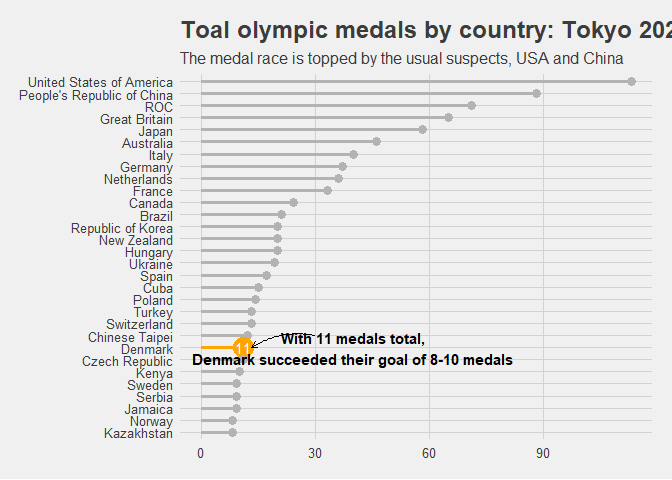
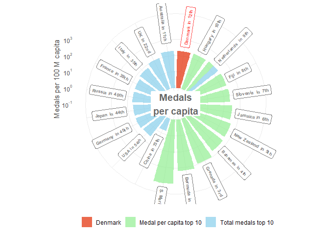

Import data


Total medals per country

```r
medals_30 <-
  medals %>%
  mutate(
    team_noc = fct_reorder(team_noc, total)
  ) %>%
  slice_max(team_noc, n = 30)

medals_30 %>%
  ggplot(aes(team_noc, total)) +
  geom_segment(aes(x = team_noc, xend = team_noc, y = 0, yend = total),
    color = if_else(medals_30$team_noc == "Denmark", "orange", "grey70"),
    size = 1.2, color = "grey70"
  ) +
  geom_point(aes(team_noc, total),
    color = if_else(medals_30$team_noc == "Denmark", "orange", "grey70"),
    size = if_else(medals_30$team_noc == "Denmark", 7, 3)
  ) +
  geom_text(aes(team_noc, total, label = if_else(team_noc == "Denmark", total, NULL)), color = "white") +
  coord_flip() +
  labs(
    y = NULL,
    x = NULL,
    title = "Toal olympic medals by country: Tokyo 2021",
    subtitle = "The medal race is topped by the usual suspects, USA and China"
  ) +
  annotate("text", x = 8, y = 40, label = "With 11 medals total,\nDenmark reached their goal of 8-10 medals", fontface = "bold") +
  annotate(
    geom = "curve", x = 9, y = 30, xend = 8, yend = 13,
    curvature = .2, arrow = arrow(length = unit(2, "mm"))
  ) +
  theme_fivethirtyeight() +
  theme_custom
```

<!-- -->

Detailed overview in table

```r
medals %>%
  datatable() %>%
  formatStyle(
    columns = "gold",
    backgroundColor = "gold"
  ) %>%
  formatStyle("silver", backgroundColor = "silver") %>%
  formatStyle("bronze", backgroundColor = "orange")
```

```{=html}
<div id="htmlwidget-ac153df7dfd0b2e77930" style="width:100%;height:auto;" class="datatables html-widget"></div>
<script type="application/json" data-for="htmlwidget-ac153df7dfd0b2e77930">{"x":{"style":"bootstrap4","filter":"none","vertical":false,"data":[["1","2","3","4","5","6","7","8","9","10","11","12","13","14","15","16","17","18","19","20","21","22","23","24","25","26","27","28","29","30","31","32","33","34","35","36","37","38","39","40","41","42","43","44","45","46","47","48","49","50","51","52","53","54","55","56","57","58","59","60","61","62","63","64","65","66","67","68","69","70","71","72","73","74","75","76","77","78","79","80","81","82","83","84","85","86","87","88","89","90","91","92","93"],[1,2,3,4,5,6,7,8,9,10,11,12,13,14,15,16,17,18,19,20,21,22,23,24,25,26,27,28,29,30,31,32,33,34,35,36,36,38,39,39,41,42,42,44,45,46,46,48,49,50,50,52,53,54,55,56,56,58,59,59,59,59,63,63,63,66,67,68,69,70,71,72,72,74,74,74,77,77,77,77,77,77,83,84,85,86,86,86,86,86,86,86,86],["United States of America","People's Republic of China","Japan","Great Britain","ROC","Australia","Netherlands","France","Germany","Italy","Canada","Brazil","New Zealand","Cuba","Hungary","Republic of Korea","Poland","Czech Republic","Kenya","Norway","Jamaica","Spain","Sweden","Switzerland","Denmark","Croatia","Islamic Republic of Iran","Serbia","Belgium","Bulgaria","Slovenia","Uzbekistan","Georgia","Chinese Taipei","Turkey","Greece","Uganda","Ecuador","Ireland","Israel","Qatar","Bahamas","Kosovo","Ukraine","Belarus","Romania","Venezuela","India","Hong Kong, China","Philippines","Slovakia","South Africa","Austria","Egypt","Indonesia","Ethiopia","Portugal","Tunisia","Estonia","Fiji","Latvia","Thailand","Bermuda","Morocco","Puerto Rico","Colombia","Azerbaijan","Dominican Republic","Armenia","Kyrgyzstan","Mongolia","Argentina","San Marino","Jordan","Malaysia","Nigeria","Bahrain","Saudi Arabia","Lithuania","North Macedonia","Namibia","Turkmenistan","Kazakhstan","Mexico","Finland","Botswana","Burkina Faso","Côte d'Ivoire","Ghana","Grenada","Kuwait","Republic of Moldova","Syrian Arab Republic"],[39,38,27,22,20,17,10,10,10,10,7,7,7,7,6,6,4,4,4,4,4,3,3,3,3,3,3,3,3,3,3,3,2,2,2,2,2,2,2,2,2,2,2,1,1,1,1,1,1,1,1,1,1,1,1,1,1,1,1,1,1,1,1,1,1,0,0,0,0,0,0,0,0,0,0,0,0,0,0,0,0,0,0,0,0,0,0,0,0,0,0,0,0],[41,32,14,21,28,7,12,12,11,10,6,6,6,3,7,4,5,4,4,2,1,8,6,4,4,3,2,1,1,1,1,0,5,4,2,1,1,1,0,0,0,0,0,6,3,3,3,2,2,2,2,2,1,1,1,1,1,1,0,0,0,0,0,0,0,4,3,3,2,2,1,1,1,1,1,1,1,1,1,1,1,1,0,0,0,0,0,0,0,0,0,0,0],[33,18,17,22,23,22,14,11,16,20,11,8,7,5,7,10,5,3,2,2,4,6,0,6,4,2,2,5,3,2,1,2,1,6,9,1,1,0,2,2,1,0,0,12,3,0,0,4,3,1,1,0,5,4,3,2,2,0,1,1,1,1,0,0,0,1,4,2,2,1,3,2,2,1,1,1,0,0,0,0,0,0,8,4,2,1,1,1,1,1,1,1,1],[113,88,58,65,71,46,36,33,37,40,24,21,20,15,20,20,14,11,10,8,9,17,9,13,11,8,7,9,7,6,5,5,8,12,13,4,4,3,4,4,3,2,2,19,7,4,4,7,6,4,4,3,7,6,5,4,4,2,2,2,2,2,1,1,1,5,7,5,4,3,4,3,3,2,2,2,1,1,1,1,1,1,8,4,2,1,1,1,1,1,1,1,1],[1,2,5,4,3,6,9,10,8,7,11,12,13,18,13,13,19,23,25,29,26,17,26,20,23,29,33,26,33,39,42,42,29,22,20,47,47,60,47,47,60,66,66,16,33,47,47,33,39,47,47,60,33,39,42,47,47,66,66,66,66,66,77,77,77,42,33,42,47,60,47,60,60,66,66,66,77,77,77,77,77,77,29,47,66,77,77,77,77,77,77,77,77]],"container":"<table class=\"table table-striped table-hover row-border order-column display\">\n  <thead>\n    <tr>\n      <th> <\/th>\n      <th>rank<\/th>\n      <th>team_noc<\/th>\n      <th>gold<\/th>\n      <th>silver<\/th>\n      <th>bronze<\/th>\n      <th>total<\/th>\n      <th>rank_by_total<\/th>\n    <\/tr>\n  <\/thead>\n<\/table>","options":{"columnDefs":[{"className":"dt-right","targets":[1,3,4,5,6,7]},{"orderable":false,"targets":0}],"order":[],"autoWidth":false,"orderClasses":false,"rowCallback":"function(row, data, displayNum, displayIndex, dataIndex) {\nvar value=data[3]; $(this.api().cell(row, 3).node()).css({'background-color':'gold'});\nvar value=data[4]; $(this.api().cell(row, 4).node()).css({'background-color':'silver'});\nvar value=data[5]; $(this.api().cell(row, 5).node()).css({'background-color':'orange'});\n}"}},"evals":["options.rowCallback"],"jsHooks":[]}</script>
```

Plot of top 10 total medals per countries compared to top 10 total medals countries per capita. Maybe a circular barplot?

```r
population %>%
  filter(year == 2013) %>%
  left_join(medals %>%
    rename(country = team_noc), by = "country") %>%
  drop_na() %>%
  mutate(
    medals_per_capita = (total / population) * 1e8,
    group = factor("Most medals per capita top 10")
  ) %>%
  slice_max(medals_per_capita, n = 10) %>%
  bind_rows(
    population %>%
      filter(year == 2013) %>%
      left_join(medals %>%
        rename(country = team_noc) %>%
        mutate(
          country = str_replace_all(country, c(
            "ROC" = "Russia",
            "Great Britain" = "United Kingdom of Great Britain and Northern Ireland",
            "People's Republic of China" = "China"
          ))
        ), by = "country") %>%
      drop_na() %>%
      mutate(
        medals_per_capita = (total / population) * 1e8,
        group = factor("Medals total top 10 countries")
      ) %>%
      slice_min(rank_by_total, n = 10)
  ) %>%
  group_by(group) %>% 
  mutate(country = fct_reorder(country, medals_per_capita)) %>% 
  ggplot(aes(country, medals_per_capita, fill = group)) +
  geom_col(position = "dodge", color = "black", alpha = .5) + 
  coord_polar() + 
  theme_fivethirtyeight() +
  scale_fill_tableau(palette = "Jewel Bright") +
  scale_y_log10() +
  labs(fill = NULL,
       title = "Medal per capita",
       subtitle = "Comparison between the top 10 countries based on total medals and top 10 countries based on most medals per capita")
```

<!-- -->

```r
# TODO overvej også at smide Danmark ind i plottet
```
